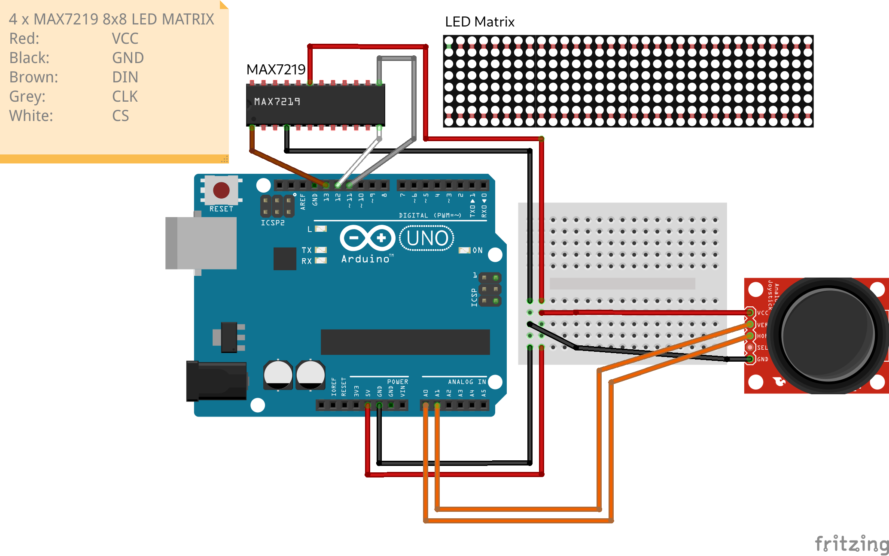

# Snake on Arduino uno and MAXLED7219 LED Matrix
## Setup
  

## Datasheets
Important datasheets for this project:  
* [Arduino Datasheet](/documentation/Datasheet_Arduino.pdf)
* [MAX7219 Datasheet](/documentation/Datasheet_MAX7219.pdf)